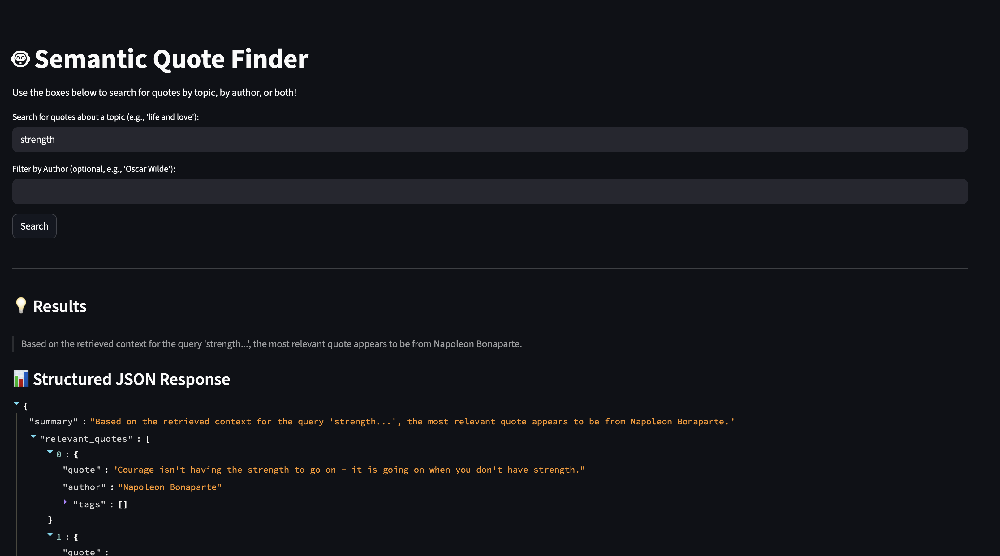
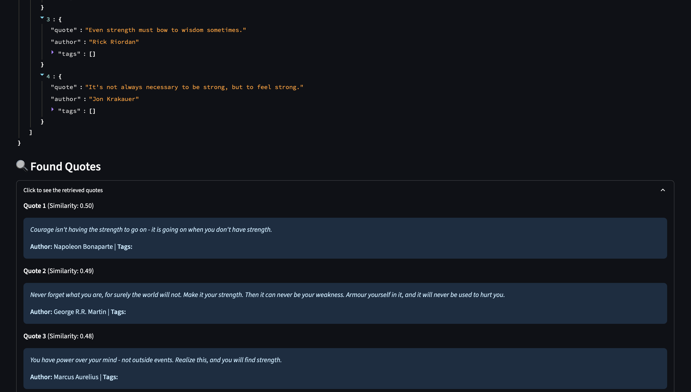

# RAG-Based Semantic Quote Retrieval System

This project is a semantic quote retrieval system that uses a Retrieval-Augmented Generation (RAG) pipeline. Users can search for quotes using natural language queries, and the system retrieves relevant quotes, providing a structured JSON response and a concise summary generated by a Large Language Model (LLM).

---

## 🏛️ System Architecture

The project follows a standard RAG workflow:

1.  **Data Preparation & Indexing**: The `Abirate/english_quotes` dataset is downloaded from HuggingFace, cleaned, and processed. Each quote is then encoded into a vector embedding using a sentence-transformer model.
2.  **Vector Store**: These embeddings are stored in a FAISS (Facebook AI Similarity Search) index for fast and efficient similarity searches.
3.  **Retrieval**: When a user enters a query, it's encoded into a vector. FAISS is used to find the most similar (i.e., most relevant) quotes from the index.
4.  **Generation**: The retrieved quotes are passed as context to a powerful LLM (OpenAI's GPT-3.5-Turbo). The LLM generates a structured JSON response, including a summary and a list of the most relevant quotes based *only* on the provided context.
5.  **User Interface**: A Streamlit application provides a user-friendly interface for querying the system and viewing the results.

---

## ✨ Features

* **Semantic Search**: Find quotes based on meaning, not just keywords.
* **Author Filtering**: Narrow down search results by a specific author.
* **Structured Output**: Receive results in a clean JSON format, perfect for downstream applications.
* **AI-Powered Summaries**: Get a quick, AI-generated summary of the retrieved quotes.
* **Interactive UI**: An easy-to-use web interface built with Streamlit.
* **Evaluation Framework**: Includes a script to evaluate the RAG pipeline's performance using the `RAGAS` library.

---

## 🚀 Setup and Installation

Follow these steps to set up and run the project locally.

### Prerequisites

* Python 3.9+
* An OpenAI API key with an active quota.

### 1. Clone the Repository

Clone this project to your local machine.

```bash
git clone <your-repository-url>
cd <your-repository-name>

```


📂 File Structure
.
├── rag_assets/            # Generated by prepare_data.py
│   ├── quotes.index
│   └── quotes_data.csv
├── .env                   # You must create this file for your API key
├── app.py                 # The main Streamlit application
├── evaluate_rag.py        # RAGAS evaluation script
├── prepare_data.py        # Data download, cleaning, and indexing script
├── rag_pipeline.py        # Core RAG logic (retrieval and generation)
├── README.md              # This file
└── requirements.txt       # Project dependencies







